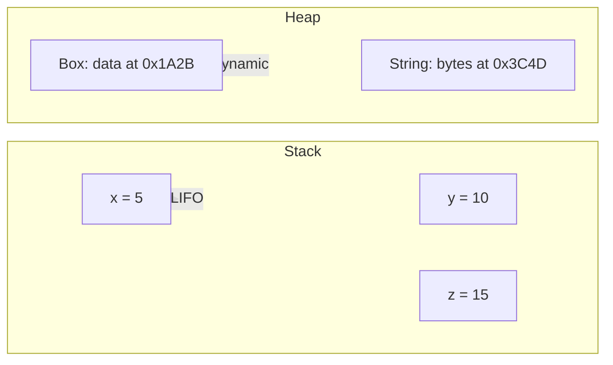

``

# Memory Management Basics

Every program uses memory. Understanding how memory works is essential for understanding why Rust exists. This file explains the problem. The next module explains Rust's solution.

## The Two Memory Regions

When a program runs, the operating system gives it memory divided into two regions:

### The Stack

Fast, automatic, organized. Think of a stack of plates.

- Data goes on top, comes off the top (last in, first out)
- The compiler knows exactly how much space each value needs
- When a function returns, all its stack data is automatically freed

```
FUNCTION calculate_area(width, height)
    // width and height are stored on the stack
    area = width * height      // area is stored on the stack
    RETURN area                // area, width, height are popped off the stack
END FUNCTION
```

Values with fixed, known size at compile time go on the stack: integers, floats, booleans, fixed-size arrays. This is fast and automatic.

### The Heap

Slower, dynamic, flexible. Think of a big warehouse where you request space as needed.

- You ask for space at runtime (allocation)
- You get back an address pointing to that space (a pointer)
- You must free the space when done (deallocation)
- If you forget to free it, the memory stays occupied (memory leak)

```
CREATE list AS DYNAMIC_ARRAY    // allocate space on the heap
ADD 1 TO list                    // heap grows
ADD 2 TO list                    // heap grows more
ADD 3 TO list                    // heap grows more
// when is this freed?
```

Values with size that changes at runtime go on the heap: strings (users can type any length), dynamic lists, large data structures.

### Stack vs Heap Comparison



| Property | Stack | Heap |
|----------|-------|------|
| Speed | Very fast | Slower |
| Allocation | Automatic | Manual or GC |
| Size | Fixed, known at compile time | Dynamic, determined at runtime |
| Lifetime | Bound to function scope | Must be managed explicitly |
| Access pattern | Last in, first out | Random access via pointer |

## The Problem: Who Frees Heap Memory?

Every language must answer this question. Different approaches:

### Manual Management

The programmer explicitly allocates and frees memory. Used in C and C++.

```
// C code
int* list = malloc(100 * sizeof(int));  // allocate
// use list...
free(list);                              // YOU must free it
```

Problems:
- Forget to free: memory leak. The program slowly consumes all available memory.
- Free too early: use-after-free. Another part of the program still references the freed memory. Undefined behavior, crashes, security vulnerabilities.
- Free twice: double-free. Corrupts the memory allocator. Crashes.

Manual management is the source of approximately 70% of all security vulnerabilities in C/C++ code bases (per Microsoft and Google studies).

### Garbage Collection (GC)

A runtime system periodically scans memory and frees anything no longer reachable. Used in Java, Python, JavaScript, Go.

```
list = [1, 2, 3]      // allocate
list = None             // GC will free the old list eventually
```

Advantages: programmer never manually frees memory. Fewer bugs.

Disadvantages:
- The GC runs unpredictably, causing pauses (latency spikes)
- Uses more total memory (keeps dead objects until the next GC cycle)
- No control over when memory is freed

### Rust's Approach: Ownership

Rust does neither. No manual malloc/free. No garbage collector. Instead, the compiler tracks who "owns" each piece of heap memory and inserts free calls at compile time.

You will learn exactly how this works in 02-ownership-and-safety/01-ownership.md. The key insight: Rust gives you the safety of garbage collection with the performance and control of manual management. This is why Rust exists.
