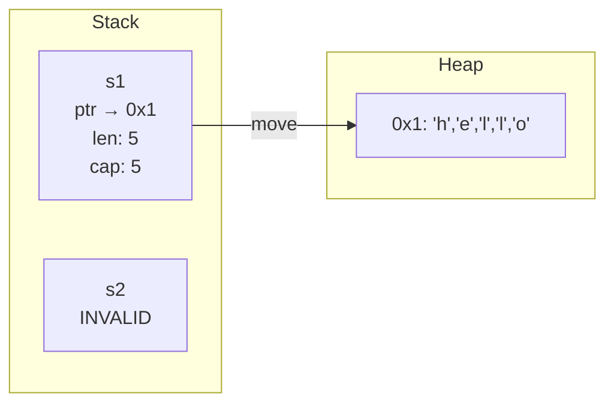
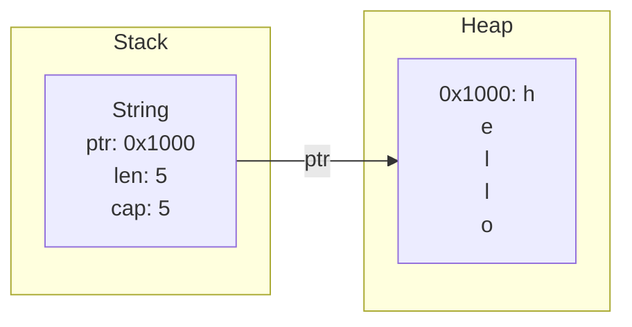

`` ``

# Ownership

Ownership is Rust's central concept. It replaces both manual memory management and garbage collection with compile-time rules. Every other Rust feature builds on ownership.

## The Three Rules

1. **Each value has exactly one owner.** A variable is the owner of its value.
2. **When the owner goes out of scope, the value is dropped (freed).** No manual `free()`. No garbage collector. The compiler inserts the deallocation.
3. **There can only be one owner at a time.** Assigning a value to another variable moves ownership. The old variable is no longer valid.

## Rule 1 and 2: Ownership and Dropping

```rust
fn main() {
    {
        let s = String::from("hello");   // s owns the String
        println!("{s}");                  // use it
    }                                     // s goes out of scope, String is dropped here

    // println!("{s}");                   // ERROR: s no longer exists
}
```

Step by step:
- `String::from("hello")` — allocate a String on the heap
- `s` is the owner of this String
- When the inner block ends, `s` goes out of scope
- Rust automatically calls `drop(s)`, freeing the heap memory

This is deterministic. You know exactly when memory is freed: when the owner leaves scope.

## Rule 3: Move Semantics



```rust
fn main() {
    let s1 = String::from("hello");
    let s2 = s1;              // ownership moves from s1 to s2

    // println!("{s1}");      // ERROR: s1 is no longer valid
    println!("{s2}");         // OK: s2 owns the String
}
```

Step by step:
- `s1` owns the String "hello"
- `let s2 = s1` — ownership transfers (moves) from `s1` to `s2`
- `s1` is now invalid. Using it is a compile error.

Why? If both `s1` and `s2` pointed to the same heap data, Rust would free it twice when both go out of scope (double-free). Moving ownership prevents this.

### Stack-Only Types: Copy

Integers, floats, booleans, and chars are fixed-size and stored entirely on the stack. They implement the `Copy` trait. Assignment copies the value instead of moving it:

```rust
fn main() {
    let x: i32 = 5;
    let y = x;          // x is copied (i32 is Copy)

    println!("x = {x}");  // OK: x is still valid
    println!("y = {y}");  // OK: y has its own copy
}
```

| Type | On assignment | After |
|------|--------------|-------|
| `String` | Moves | Old variable invalid |
| `i32`, `f64`, `bool`, `char` | Copies | Both variables valid |
| `Vec<T>` | Moves | Old variable invalid |
| Arrays of Copy types `[i32; 3]` | Copies | Both variables valid |

## Ownership and Functions

Passing a value to a function transfers ownership:

```rust
fn take_ownership(s: String) {
    println!("Got: {s}");
}   // s is dropped here

fn make_copy(x: i32) {
    println!("Got: {x}");
}   // x goes out of scope, but nothing special happens (it's a copy)

fn main() {
    let s = String::from("hello");
    take_ownership(s);
    // println!("{s}");    // ERROR: s was moved into the function

    let x = 5;
    make_copy(x);
    println!("x is still: {x}");    // OK: i32 is Copy
}
```

Step by step:
- `take_ownership(s)` — ownership of the String moves into the function. `s` is invalid afterward.
- `make_copy(x)` — `x` is copied into the function. `x` is still valid.

## Returning Ownership

Functions can return ownership to the caller:

```rust
fn create_string() -> String {
    let s = String::from("hello");
    s                       // return ownership to caller
}

fn main() {
    let s = create_string();    // s now owns the String
    println!("{s}");
}
```

## What Is Happening in Memory



```
let s1 = String::from("hello");
```

Memory layout:
```
Stack (s1):           Heap:
+-----------+        +---+---+---+---+---+
| ptr       | -----> | h | e | l | l | o |
| len: 5    |        +---+---+---+---+---+
| capacity: 5|
+-----------+
```

- The stack frame holds the pointer, length, and capacity
- The heap holds the actual character data
- `s1` owns both (logically — the stack part refers to the heap part)

```
let s2 = s1;  // move
```

- The pointer, length, and capacity are copied to `s2`'s stack slot
- `s1` is marked invalid (the compiler knows, not a runtime flag)
- The heap data is not duplicated (no deep copy)
- When `s2` is dropped, the heap is freed once

## Why This Matters

No garbage collector needed. No double-free possible. No use-after-free possible. The compiler proves memory safety at compile time. If your code compiles, it is memory safe.

## Next

If ownership means only one variable can use a value, how do you let functions read your data without taking it? Borrowing. That is the next file.
