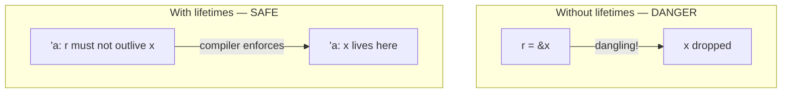

``

# Lifetimes

Lifetimes are Rust's way of ensuring references are always valid. The compiler tracks how long each reference lives. Most of the time, you do not need to annotate lifetimes — the compiler figures them out. But sometimes you must be explicit.

## The Problem Lifetimes Solve



```rust
fn main() {
    let r;                       // declare r without a value

    {
        let x = 5;
        r = &x;                  // r references x
    }                             // x goes out of scope here. x is dropped.

    // println!("{r}");          // ERROR: r points to freed memory
}
```

`x` lives inside the inner block. `r` lives in the outer block. When the inner block ends, `x` is dropped. If Rust allowed you to use `r`, it would be a dangling reference. The compiler prevents this.

Every reference has a lifetime: the scope during which it is valid. The compiler analyzes all lifetimes and rejects code where a reference could outlive the data it points to.

## When the Compiler Needs Help

Most of the time, the compiler infers lifetimes. In simple cases, you write nothing:

```rust
fn first_word(s: &str) -> &str {
    // compiler knows: the returned reference comes from s
    // no annotation needed in some cases, but for this specific function...
}
```

But when a function takes multiple references and returns a reference, the compiler cannot always determine which input the output came from. You must tell it:

```rust
fn first_word<'a>(s: &'a str) -> &'a str {
    let bytes = s.as_bytes();

    for (i, &item) in bytes.iter().enumerate() {
        if item == b' ' {
            return &s[0..i];
        }
    }

    &s[..]
}
```

Step by step:
- `<'a>` — declare a lifetime parameter named `'a`
- `s: &'a str` — the input reference lives for lifetime `'a`
- `-> &'a str` — the returned reference lives for the same lifetime `'a`

This tells the compiler: "the returned reference is valid for as long as the input reference is valid."

## What This Means in Practice

```rust
fn main() {
    let string = String::from("hello world");

    let word = first_word(&string);   // word borrows string

    // string.clear();                 // ERROR: cannot mutably borrow string
    //                                   because word is still borrowing it

    println!("{word}");                // OK: word is still valid
}
```

The lifetime annotation ensures that `word` (which borrows from `string`) prevents modifications to `string` while `word` exists.

## The Elision Rules

You do not write lifetimes for most functions. The compiler applies three rules (lifetime elision):

**Rule 1:** Each parameter that is a reference gets its own lifetime.

```rust
fn foo(x: &str, y: &str)
// compiler sees: fn foo<'a, 'b>(x: &'a str, y: &'b str)
```

**Rule 2:** If there is exactly one input lifetime, it is assigned to all outputs.

```rust
fn foo(x: &str) -> &str
// compiler sees: fn foo<'a>(x: &'a str) -> &'a str
```

**Rule 3:** If there are multiple input lifetimes but one of them is `&self` or `&mut self`, that lifetime is assigned to all outputs. (Applies to methods.)

If these three rules cannot resolve all output lifetimes, you must annotate explicitly.

## Structs Holding References

When a struct holds a reference, you must declare a lifetime:

```rust
struct Excerpt<'a> {
    content: &'a str,
}

fn main() {
    let novel = String::from("Call me Ishmael. Some years ago...");
    let first_sentence = novel.split('.').next().unwrap();

    let excerpt = Excerpt {
        content: first_sentence,
    };

    println!("{}", excerpt.content);
}
```

Step by step:
- `<'a>` on the struct — the struct cannot outlive the reference it holds
- `content: &'a str` — the reference stored in the struct lives for `'a`
- The compiler ensures `excerpt` does not outlive `novel`

## Common Patterns

| Pattern | Annotation needed? |
|---------|-------------------|
| Function with one reference param | No (elision rule 2) |
| Function with multiple reference params, returns a reference | Yes |
| Method returning `&self` data | No (elision rule 3) |
| Struct holding a reference | Yes |
| Struct holding owned data (String, Vec) | No |

## The Key Insight

Do not overthink lifetimes. In practice:

1. Write your code without lifetime annotations
2. If it compiles, you are done
3. If the compiler says "missing lifetime specifier," add `<'a>` and connect the inputs to outputs
4. The compiler error message usually tells you exactly what to do

Lifetimes are not a new concept. They exist in every language. Rust just makes them explicit and enforced. In C, you have the same problem (dangling pointers) but the compiler does not catch it. Rust catches it at compile time.

## Next

Traits define shared behavior. They are Rust's answer to interfaces. The next file covers trait bounds, impl Trait, and trait objects.
