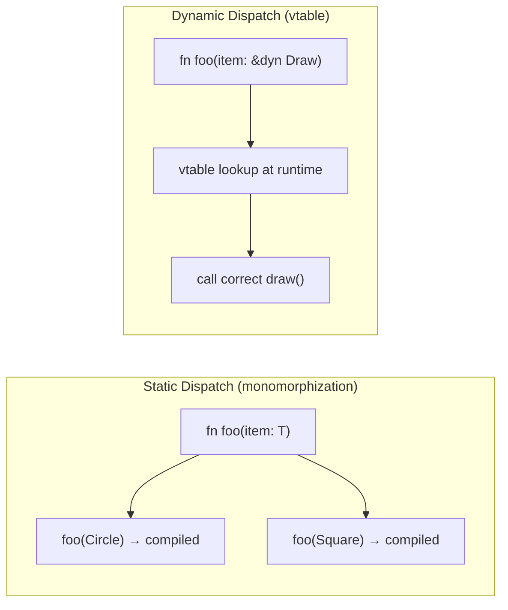

`` ``

# Traits

Traits define shared behavior. If you know interfaces from Java or TypeScript, traits are similar but more powerful. They define what a type can do, not what data it holds.

## Defining and Implementing a Trait

```rust
trait Summary {
    fn summarize(&self) -> String;
}

struct Article {
    title: String,
    author: String,
    content: String,
}

struct Tweet {
    username: String,
    content: String,
}

impl Summary for Article {
    fn summarize(&self) -> String {
        format!("{} by {}", self.title, self.author)
    }
}

impl Summary for Tweet {
    fn summarize(&self) -> String {
        format!("@{}: {}", self.username, self.content)
    }
}

fn main() {
    let article = Article {
        title: String::from("Rust Guide"),
        author: String::from("Alice"),
        content: String::from("Long content here..."),
    };
    let tweet = Tweet {
        username: String::from("bob"),
        content: String::from("Learning Rust!"),
    };

    println!("{}", article.summarize());  // "Rust Guide by Alice"
    println!("{}", tweet.summarize());    // "@bob: Learning Rust!"
}
```

Step by step:
- `trait Summary` — define a trait with one required method
- `impl Summary for Article` — implement the trait for the `Article` type
- Each type provides its own implementation of `summarize`
- Call the method on instances: `article.summarize()`

## Default Implementations

Traits can provide default method bodies:

```rust
trait Greet {
    fn greet(&self) -> String {
        String::from("Hello!")
    }
}

struct Person {
    name: String,
}

impl Greet for Person {}   // uses the default implementation

fn main() {
    let p = Person { name: String::from("Alice") };
    println!("{}", p.greet());    // prints: Hello!
}
```

You get the default behavior without writing any method body. Override it by providing your own implementation when needed.

## Common Standard Library Traits

| Trait | What it does | Example usage |
|-------|-------------|---------------|
| `Debug` | Format for debugging `{:?}` | `println!("{:?}", value)` |
| `Display` | Format for users `{}` | `println!("{}", value)` |
| `Clone` | Create a deep copy | `let b = a.clone()` |
| `Copy` | Implicit copy on assignment | Integers, floats, booleans |
| `PartialEq` | Equality comparison `==` | `if a == b` |
| `Hash` | Usable as hash map key | `HashMap<K, V>` |
| `From` / `Into` | Type conversions | `String::from("hello")` |
| `Iterator` | Iterate over values | `for item in collection` |

Derive common traits with a macro instead of implementing manually:

```rust
#[derive(Debug, Clone, PartialEq)]
struct Point {
    x: f64,
    y: f64,
}

fn main() {
    let p1 = Point { x: 1.0, y: 2.0 };
    let p2 = p1.clone();
    println!("{:?}", p1);         // Point { x: 1.0, y: 2.0 }
    println!("{}", p1 == p2);     // true
}
```

## Trait Bounds — Constraining Generics

When you write a generic function, you can require that the type implements certain traits:

```rust
fn print_summary<T: Summary>(item: &T) {
    println!("{}", item.summarize());
}
```

Step by step:
- `<T: Summary>` — `T` can be any type that implements `Summary`
- You can call `summarize()` on `item` because the bound guarantees it exists

Multiple bounds:

```rust
fn compare_and_summarize<T: Summary + PartialEq>(a: &T, b: &T) {
    if a == b {
        println!("Same: {}", a.summarize());
    }
}
```

`where` clause for cleaner syntax with many bounds:

```rust
fn some_function<T, U>(t: &T, u: &U)
where
    T: Summary + Clone,
    U: Clone + PartialEq,
{
    // implementation
}
```

## impl Trait — Return Types

```rust
fn create_summarizable() -> impl Summary {
    Article {
        title: String::from("News"),
        author: String::from("Reporter"),
        content: String::from("Details..."),
    }
}
```

`-> impl Summary` means "I return some type that implements Summary." The caller does not know the exact type. This is useful for returning closures or iterators.

## Trait Objects — Dynamic Dispatch

When you need to store different types that share a trait in a collection:

```rust
fn main() {
    let items: Vec<Box<dyn Summary>> = vec![
        Box::new(Article {
            title: String::from("News"),
            author: String::from("Reporter"),
            content: String::from("Content"),
        }),
        Box::new(Tweet {
            username: String::from("bob"),
            content: String::from("Hello!"),
        }),
    ];

    for item in &items {
        println!("{}", item.summarize());
    }
}
```

Step by step:
- `Box<dyn Summary>` — a trait object. Points to any type implementing `Summary`.
- `Box::new(...)` — allocate on the heap. Required because different types have different sizes.
- `dyn Summary` — dynamic dispatch. The method to call is determined at runtime.

### Static vs Dynamic Dispatch



| Property | Generics (static) | Trait objects (dynamic) |
|----------|-------------------|------------------------|
| Monomorphization | Yes (code generated per type) | No (one code path) |
| Runtime cost | Zero | Small (vtable lookup) |
| Binary size | Larger (more generated code) | Smaller |
| Different types in one collection | No | Yes |

Prefer generics (static dispatch) when possible. Use trait objects when you need heterogeneous collections or when the set of types is not known at compile time.

## Next

Rust has no exceptions and no null. The next file covers how Rust handles errors using `Result` and `Option`.
