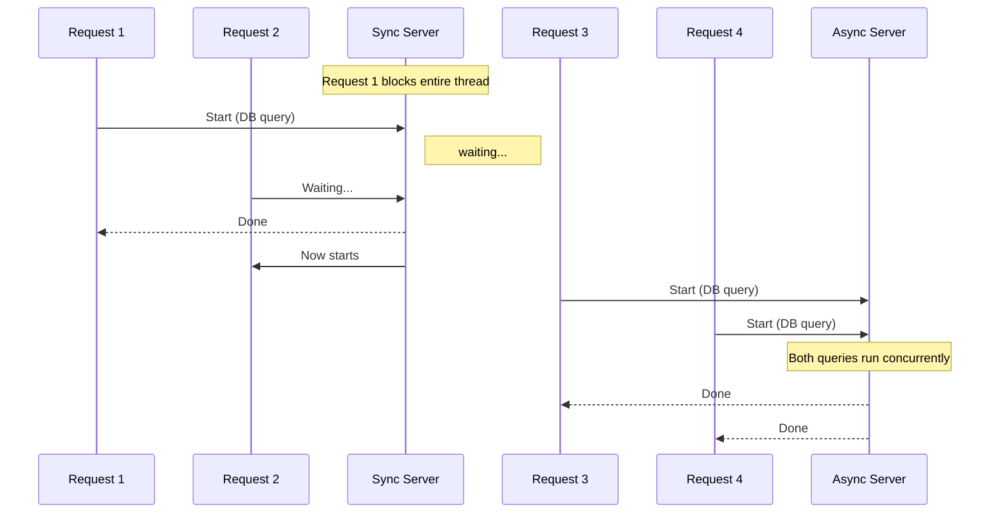

``

# Async Rust

Async Rust lets your program do other work while waiting for I/O operations (network requests, file reads, database queries). This is essential for backend services that handle many simultaneous connections.

## Why Async

A synchronous server handles one request at a time:



```
Request 1: [wait for database] [send response]
Request 2:                      [wait for database] [send response]
```

Total time: sum of all waits. Request 2 waits for Request 1 to finish.

An async server handles many requests concurrently:

```
Request 1: [start db query] ............... [process result] [send response]
Request 2:       [start db query] ............... [process result] [send response]
Request 3:             [start db query] ............... [process result] [send response]
```

While Request 1 waits for the database, the runtime starts Request 2 and Request 3. Total time: roughly the longest single request, not the sum.

| Scenario | Use async? |
|----------|-----------|
| I/O-bound (database, network, files) | Yes |
| CPU-bound (calculations, image processing) | No (use threads or spawn_blocking) |
| Mixed | Yes for I/O, spawn_blocking for CPU parts |

## async/await Syntax

```rust
async fn fetch_user(id: u32) -> String {
    // simulate a database query
    tokio::time::sleep(std::time::Duration::from_millis(100)).await;
    format!("User {id}")
}

async fn main_logic() {
    let user = fetch_user(1).await;
    println!("{user}");
}
```

Step by step:
- `async fn` — declare an async function. It returns a `Future` instead of the direct value.
- `.await` — pause this function until the future resolves. While waiting, the runtime can do other work.
- `.await` does not block the thread. It yields control back to the runtime.

`async` functions return a `Future`. You must `.await` a future to get its value.

## The Tokio Runtime

Async functions need a runtime to execute them. Tokio is the standard Rust async runtime.

Set up Tokio in `Cargo.toml`:

```toml
[dependencies]
tokio = { version = "1", features = ["rt-multi-thread", "macros", "signal"] }
```

Entry point:

```rust
#[tokio::main]
async fn main() {
    println!("Server starting...");
    // your async code here
}
```

Step by step:
- `#[tokio::main]` — a macro that wraps `async fn main()` with the Tokio runtime setup. It creates the runtime and runs your async main inside it.
- `features = ["rt-multi-thread"]` — multi-threaded scheduler (one thread per CPU core by default)
- `features = ["macros"]` — enables the `#[tokio::main]` macro
- `features = ["signal"]` — graceful shutdown on Ctrl+C

## Spawning Tasks

`tokio::spawn` starts a task that runs concurrently:

```rust
use tokio::time::{sleep, Duration};

async fn process_order(id: u32) {
    sleep(Duration::from_millis(500)).await;
    println!("Order {id} processed");
}

#[tokio::main]
async fn main() {
    let mut handles = vec![];

    for i in 1..=5 {
        let handle = tokio::spawn(async move {
            process_order(i).await;
        });
        handles.push(handle);
    }

    for handle in handles {
        handle.await.unwrap();
    }

    println!("All orders processed");
}
```

Step by step:
- `tokio::spawn(async move { ... })` — start a new async task. `async move` moves captured variables into the task.
- The tasks run concurrently. All five start near-simultaneously.
- `handle.await` — wait for the task to finish
- Total time: ~500ms (all run in parallel), not ~2500ms (sequential)

### spawn vs await

| Approach | Behavior |
|----------|----------|
| `task.await` | Run sequentially. Wait for completion before continuing. |
| `tokio::spawn(task)` | Run concurrently. Continue immediately. Get a `JoinHandle` to await later. |

## When Sync vs Async

```rust
// GOOD: async for I/O
async fn fetch_from_db(pool: &sqlx::PgPool) -> Vec<User> {
    sqlx::query_as::<_, User>("SELECT * FROM users")
        .fetch_all(pool)
        .await
        .unwrap()
}

// BAD: blocking the async runtime
async fn compute_hash(data: &[u8]) -> String {
    // This is CPU-heavy. It blocks the async runtime thread.
    // Other tasks on this thread cannot progress while this runs.
    sha256(data)
}

// GOOD: offload CPU work to a blocking thread
async fn compute_hash_properly(data: Vec<u8>) -> String {
    tokio::task::spawn_blocking(move || {
        sha256(&data)
    }).await.unwrap()
}
```

Rule of thumb: if a function does I/O (network, disk, database), use async. If it does heavy computation, use `spawn_blocking`.

## Key Points

1. `async fn` declares a function that returns a `Future`
2. `.await` pauses until the future resolves (without blocking the thread)
3. `tokio::spawn` runs tasks concurrently
4. Never block the async runtime with CPU-heavy work — use `spawn_blocking`
5. Always use `async move` when spawning tasks that capture variables

## Next

Some types cannot cross thread boundaries safely. The next file explains `Send` and `Sync`, the traits that control thread safety in Rust.
