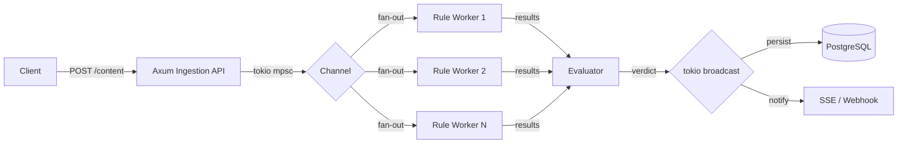
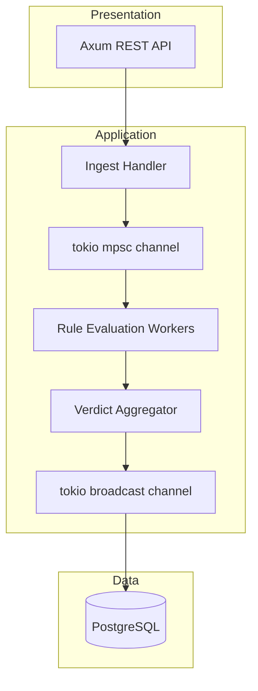

# Capstone: Content Moderation Pipeline

Build a high-throughput content moderation system that processes user-submitted text through a concurrent rule evaluation pipeline. This mirrors real-world systems that must make sub-millisecond decisions at scale — the kind of workload where Rust's zero-cost abstractions, lack of GC pauses, and fearless concurrency deliver measurable advantages.

**Challenge Repo:** https://github.com/TP-Coder-Innovation-Hub/content-moderation-system-challenge

---

## Business Context

Every platform with user-generated content needs automated moderation. The system must evaluate every submission against configurable rules, render a verdict, and log the decision — fast enough to not add user-perceptible latency. Rule evaluations run concurrently, decisions must be consistent, and the audit trail must be immutable.

---

## Learning Objectives

- Design a channel-based concurrent pipeline using `tokio::sync` primitives
- Model a business domain with Rust enums and exhaustive pattern matching
- Use `sqlx` compile-time query verification against PostgreSQL
- Implement graceful shutdown with `CancellationToken`
- Benchmark throughput with `criterion`
- Deploy a multi-service stack with Docker Compose

---

## Architecture





### Pipeline Flow

1. **Ingestion** — Axum handler validates request, enqueues `ContentItem` on `mpsc` channel
2. **Rule Workers** — N tokio tasks consume from channel, evaluate rules concurrently
3. **Verdict** — Aggregate rule results, compute final verdict via severity ranking
4. **Broadcast** — Publish `ModerationDecision` to broadcast channel
5. **Storage** — Subscribe to broadcast, persist decision + audit log via sqlx
6. **Notifications** — Subscribe to broadcast, push to SSE stream or webhook

---

## Feature Requirements

### 1. Content Ingestion API

**Endpoint:** `POST /api/v1/content`

Accept text content from users. Validate input, enqueue for moderation, return immediately with a tracking ID.

**Request:**
```json
{
  "user_id": "u_abc123",
  "content": "Some user-submitted text",
  "content_type": "text",
  "metadata": {}
}
```

**Response (202 Accepted):**
```json
{
  "id": "mod_xyz789",
  "status": "pending",
  "created_at": "2025-01-15T10:30:00Z"
}
```

**Acceptance Criteria:**
- Returns 202 with moderation ID within 1ms at p99 (enqueue only)
- Returns 400 for empty content, missing user_id, or content exceeding 10KB
- Rate-limits per user_id (see Rule Type: RateLimit)

### 2. Rule Engine

Evaluate content against configurable rules. Each rule produces a `RuleResult` with a `Severity` level. The final verdict is determined by the highest-severity match.

**Rule Types (Rust enum):**

| Variant | Fields | Logic |
|---|---|---|
| `Keyword` | `words: Vec<String>`, `severity: Severity` | Exact word match (case-insensitive, word-boundary) |
| `Regex` | `pattern: String`, `severity: Severity` | Regex match against content |
| `Length` | `max_chars: usize` | Block if content exceeds max |
| `RateLimit` | `max_requests: u32`, `window_secs: u64` | Reject if user exceeded quota |

**Severity enum:** `Low`, `Medium`, `High`, `Critical`

**Verdict enum:** `Allow`, `Flag`, `Block`

**Verdict logic:**
- `Critical` or `High` match → `Block`
- `Medium` match → `Flag`
- No matches or `Low` only → `Allow`
- `RateLimit` violation → `Block` (bypasses other rules)
- `Length` violation → `Block`

**Acceptance Criteria:**
- Rule evaluation is exhaustive — compiler rejects unhandled rule types
- Zero panics on malformed regex (return `RuleError::InvalidPattern`)
- Keyword matching uses word boundaries (`\b`), not substring

### 3. Concurrent Pipeline

Wire ingestion to rule evaluation using tokio channels.

**Requirements:**
- `tokio::sync::mpsc` channel from ingestion to worker pool (bounded, capacity 1024)
- Configurable worker count (default: num_cpus)
- Each worker receives items via `mpsc::Receiver` split
- `tokio::sync::broadcast` channel for downstream subscribers (capacity 256)
- Backpressure: if mpsc channel is full, ingestion returns 503

**Acceptance Criteria:**
- Multiple workers process items concurrently (verify with logging)
- No data races (Rust guarantees, but verify with `thread::spawn` is not used)
- Graceful shutdown: drain in-flight items before exit
- Benchmark: 10,000 items processed in under 5 seconds locally

### 4. Decision Storage and Audit Log

Persist every moderation decision to PostgreSQL.

**Tables:**

```sql
CREATE TABLE moderation_rules (
    id          UUID PRIMARY KEY DEFAULT gen_random_uuid(),
    rule_type   TEXT NOT NULL,
    config      JSONB NOT NULL,
    severity    TEXT NOT NULL,
    enabled     BOOLEAN NOT NULL DEFAULT true,
    created_at  TIMESTAMPTZ NOT NULL DEFAULT now(),
    updated_at  TIMESTAMPTZ NOT NULL DEFAULT now()
);

CREATE TABLE moderation_decisions (
    id          UUID PRIMARY KEY DEFAULT gen_random_uuid(),
    content_id  UUID NOT NULL,
    user_id     TEXT NOT NULL,
    content     TEXT NOT NULL,
    verdict     TEXT NOT NULL,
    rule_results JSONB NOT NULL,
    created_at  TIMESTAMPTZ NOT NULL DEFAULT now()
);

CREATE TABLE rate_limit_counters (
    user_id     TEXT PRIMARY KEY,
    count       INT NOT NULL DEFAULT 0,
    window_start TIMESTAMPTZ NOT NULL
);
```

**Acceptance Criteria:**
- All queries use `sqlx` with `query!()` or `query_as!()` (compile-time checked)
- Decision insert is atomic — no partial records
- Content field is searchable (GIN index on `rule_results` JSONB, pg_trgm on content)

### 5. Admin API (Rules CRUD)

**Endpoints:**

| Method | Path | Description |
|---|---|---|
| `GET` | `/api/v1/admin/rules` | List all rules |
| `POST` | `/api/v1/admin/rules` | Create a rule |
| `PUT` | `/api/v1/admin/rules/:id` | Update a rule |
| `DELETE` | `/api/v1/admin/rules/:id` | Delete a rule |
| `PATCH` | `/api/v1/admin/rules/:id/toggle` | Enable/disable a rule |

**Acceptance Criteria:**
- New rules take effect on the next content item (no restart)
- Invalid rule configs (bad regex, empty keyword list) return 422 with error detail
- Rule changes are logged (who changed what, when)

### 6. Real-time Stats

**Endpoint:** `GET /api/v1/stats`

```json
{
  "total_processed": 14829,
  "verdicts": {
    "allow": 12045,
    "flag": 2103,
    "block": 681
  },
  "block_rate": 0.046,
  "avg_latency_us": 127,
  "p99_latency_us": 892,
  "per_minute": {
    "processed": 312,
    "blocked": 14
  }
}
```

**Acceptance Criteria:**
- Stats are computed from an in-memory `Arc<Mutex<Stats>` or `AtomicU64` counters (not DB queries)
- Counters are updated on every decision
- Endpoint returns in under 1ms

---

## Tech Constraints

| Constraint | Requirement |
|---|---|
| HTTP Framework | Axum or Actix-web |
| Async Runtime | tokio |
| Pipeline Channels | `tokio::sync::mpsc` + `tokio::sync::broadcast` |
| Database | PostgreSQL via sqlx (compile-time checked) |
| Serialization | serde + serde_json |
| Domain Types | Rust enums for `RuleType`, `Severity`, `Verdict` (no stringly-typed fields) |
| Shutdown | `tokio_util::sync::CancellationToken` with drain |
| Benchmarks | `criterion` benchmarks for rule evaluation throughput |
| Containerization | Docker Compose: app + PostgreSQL |
| Error Handling | `thiserror` for domain errors, no `unwrap()` in production code |

---

## Architecture Decision Records

### ADR-001: Bounded mpsc channel over unbounded

Unbounded channels hide backpressure. A bounded channel (capacity 1024) forces the system to surface overload via 503 responses rather than silently consuming memory. This is the correct default for a system that must remain predictable under load.

### ADR-002: broadcast channel for decision fan-out

Multiple consumers need every decision (storage, notifications, stats). `tokio::sync::broadcast` provides copy-on-read semantics with a configurable lag capacity. Late consumers miss messages rather than blocking the pipeline. Alternative considered: `watch` (last-value only, insufficient for audit).

### ADR-003: sqlx compile-time queries over runtime

`query!()` and `query_as!()` verify SQL against the actual database schema at compile time. This eliminates an entire class of runtime SQL errors. The trade-off is requiring a running database during `cargo check`, handled via Docker Compose in the dev workflow and `sqlx prepare --check` in CI.

### ADR-004: Enums for domain types over strings

`RuleType`, `Severity`, and `Verdict` are Rust enums. The compiler enforces exhaustive handling — adding a new rule type or severity level is a compile error until every match site handles it. Stringly-typed alternatives (`"block"`, `"critical"`) invite typos and silent failures.

### ADR-005: In-memory counters for stats over DB aggregation

Stats counters use `AtomicU64` behind `Arc`. This avoids a DB query on every `GET /stats` call. The trade-off is counters reset on restart — acceptable for operational stats. Audit data in PostgreSQL provides the source of truth for historical analysis.

---

## Submission Checklist

- [ ] `cargo clippy` passes with no warnings
- [ ] `cargo test` passes (unit + integration)
- [ ] `sqlx prepare --check` passes (offline query metadata committed)
- [ ] Docker Compose starts app + PostgreSQL with `docker compose up`
- [ ] `criterion` benchmark results included in `benchmarks/` directory
- [ ] All endpoints return correct HTTP status codes (202, 400, 404, 422, 503)
- [ ] Graceful shutdown: send SIGTERM, verify in-flight items complete
- [ ] No `unwrap()`, `expect()`, or `panic!()` outside of tests
- [ ] README includes: setup, run, test, benchmark, API usage examples
- [ ] `.env.example` provided (no secrets committed)
