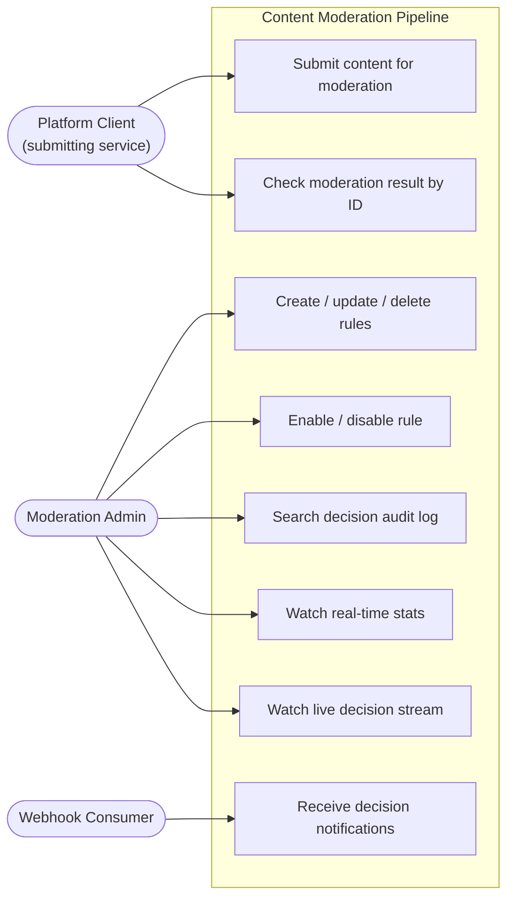
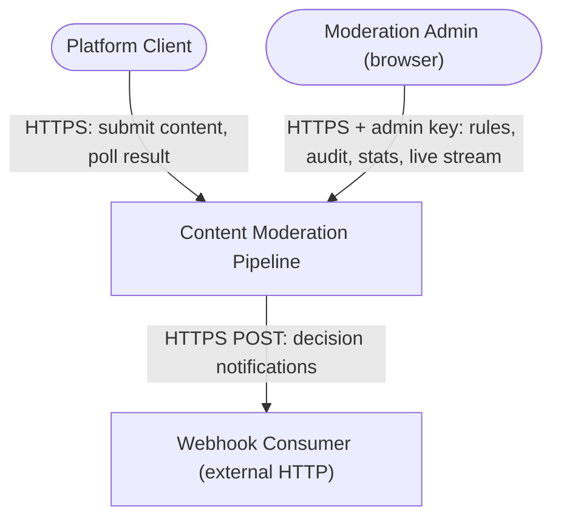
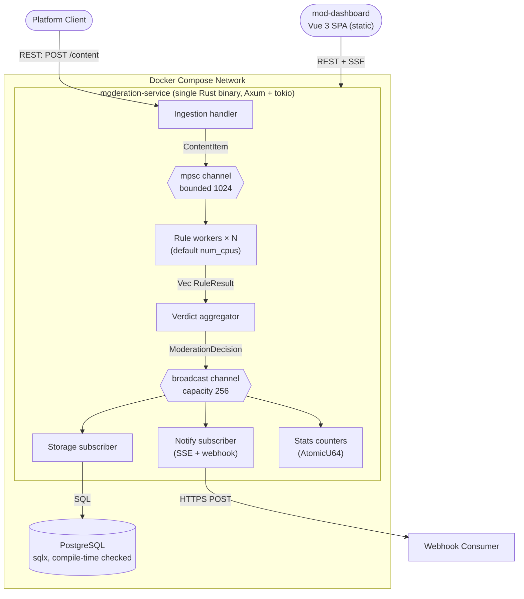
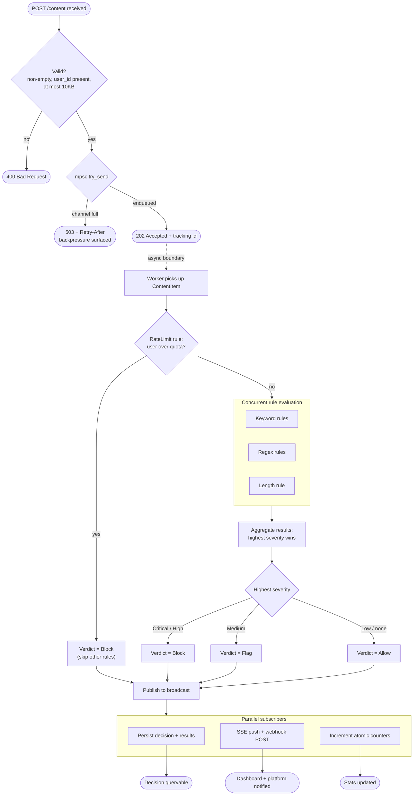
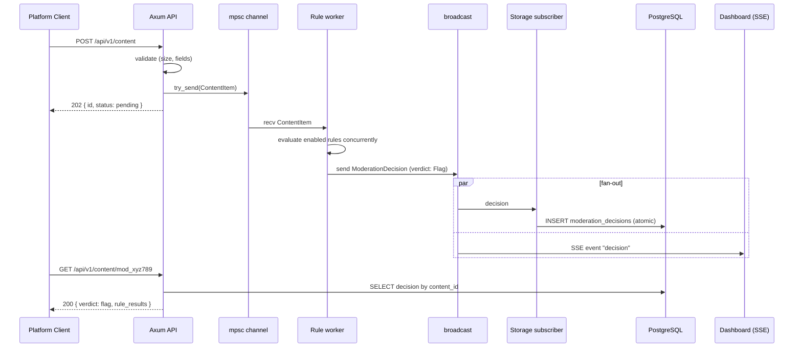
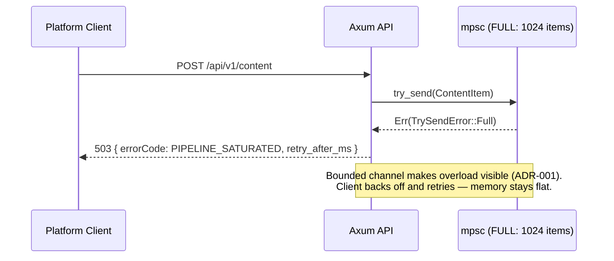
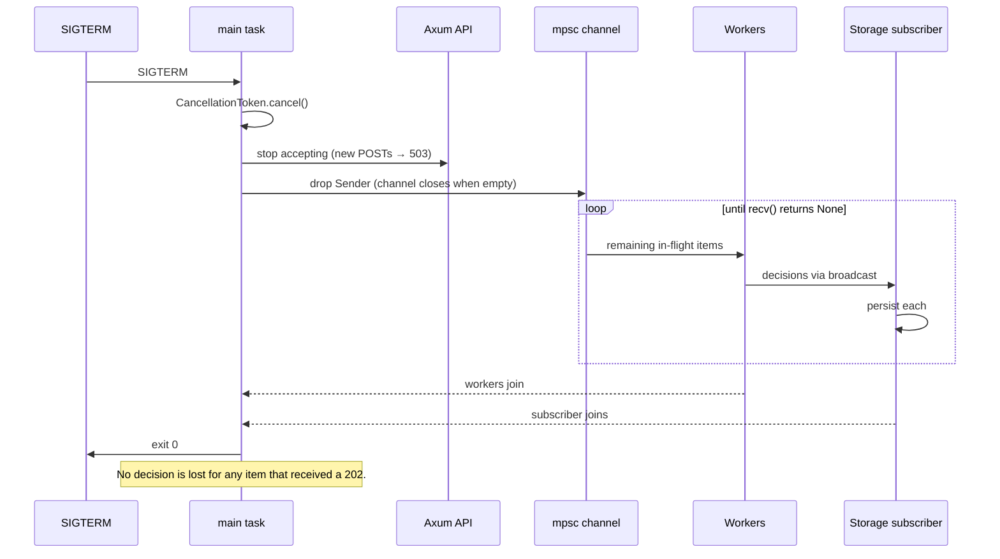

# Workshop Design: Content Moderation Pipeline

> Companion to [01-capstone-spec.md](./01-capstone-spec.md). High-level and low-level design: diagrams, contracts, schemas. **Code organization is yours** — crates, modules, workspace layout are learner decisions.

## Design Notes (read first)

1. **The "message broker" is in-process.** Unlike a Kafka-based system, the pipeline stages communicate over `tokio` channels inside one binary. Part 5 therefore documents *channel contracts* (message types, capacity, lag semantics) plus the two contracts that cross the process boundary: SSE and webhooks. Treat channel payload types with the same rigor you'd give a Kafka schema.
2. **Three additions the spec implies but doesn't define** — the dashboard needs them: `GET /api/v1/content/{id}` (look up a decision by tracking ID — the 202 response is useless without it), `GET /api/v1/decisions` (searchable audit log), and a `rule_changes` table (the spec requires "rule changes are logged" but defines no table). All three are designed below.
3. **Auth is a static admin API key.** AuthN/AuthZ is not a learning objective of this capstone; a single `X-Admin-Key` header on `/admin/*`, `/decisions*`, `/stats`, and `/stream` keeps the focus on concurrency. The public surface is only `POST /api/v1/content` and `GET /api/v1/content/{id}`.
4. **Rate limiting is a verdict, not a 429.** Per the spec, `RateLimit` is a rule type: over-quota submissions are accepted (202) and then `Block`ed by the pipeline, leaving an audit record. Ingestion only rejects on validation (400) or backpressure (503). This is a deliberate, auditable design — call it out in your README.

---

## Part 1: High-Level Design

### 1.1 Use-Case Diagram



| Actor | Description |
|---|---|
| Platform Client | An upstream service (forum, chat, marketplace) submitting user content. Machine-to-machine. |
| Moderation Admin | Operates the Vue 3 dashboard: tunes rules, audits verdicts, watches throughput. |
| Webhook Consumer | External endpoint receiving decision notifications (e.g., the platform hiding a blocked post). |

### 1.2 System Context Diagram



### 1.3 Container Diagram



| Channel | Mechanism | Notes |
|---|---|---|
| Client → ingestion | REST (JSON) | 202 fire-and-poll |
| Ingestion → workers | `tokio::sync::mpsc`, bounded 1024 | `try_send`; full → 503 (ADR-001) |
| Workers → aggregator | per-item join (e.g., `JoinSet`) | rules for one item evaluate concurrently |
| Aggregator → subscribers | `tokio::sync::broadcast`, capacity 256 | lagging consumers drop oldest (ADR-002) |
| Dashboard live feed | SSE over HTTPS | one event per decision + periodic stats |
| Service → webhook | HTTPS POST | at-most-once, no retry queue (see Part 5) |

### 1.4 Activity Diagram — Content Moderation Flow



### 1.5 Sequence Diagrams

#### 1.5.1 Happy path — submit, moderate, observe live



#### 1.5.2 Error path — backpressure under load



#### 1.5.3 Async path — graceful shutdown with drain



---

## Part 2: Frontend Design

### 2.1 Frontend Justification

One frontend: **Vue 3 moderation dashboard**. Content authors never see this system directly (their platform does); the human in the loop is the **Moderation Admin** tuning rules and auditing verdicts. The dashboard's real-time nature (SSE live feed, atomic-counter stats) is also the natural way to *demonstrate* the pipeline's concurrency — the capstone demo is the dashboard under a load generator.

### 2.2 Route Map (Vue 3)

| Route | Name | Purpose |
|---|---|---|
| `/login` | Login | Admin API key entry; stored in Pinia (memory) + sessionStorage |
| `/` | LiveDashboard | Real-time stats tiles (total, verdict split, block rate, latency p99, per-minute) + live decision ticker via SSE |
| `/rules` | RuleList | All rules: type, severity, enabled toggle, edit/delete. Create dialog |
| `/rules/:id` | RuleDetail | Config editor (per-type form), change history from `rule_changes` |
| `/decisions` | DecisionLog | Searchable audit log: filter by verdict, user_id, rule type, date range; paginated |
| `/decisions/:id` | DecisionDetail | Full content, every `RuleResult`, severity ranking that produced the verdict |
| `/:pathMatch(.*)*` | NotFound | 404 |

Pinia stores: `auth` (admin key), `stats` (SSE-fed reactive state), `rules`.

### 2.3 Key UI Interactions

| Interaction | Behavior |
|---|---|
| SSE live feed | `EventSource` to `/api/v1/stream` on dashboard mount; reconnect with exponential backoff + jitter on drop; show "live / reconnecting" indicator. Decision ticker keeps last 50 in memory only |
| Stats tiles | Updated from SSE `stats` events (server pushes every 2 s) — no polling. Tiles animate on change so reviewers *see* throughput |
| Rule editor | Per-variant form (`Keyword`: word chips; `Regex`: pattern + live server-side validation; `Length`: max chars; `RateLimit`: quota + window). Submit → 422 from server displays per-field errors — the server is the only judge of regex validity (zero-panic guarantee) |
| Rule toggle | Optimistic switch flip; revert + toast on failure. Banner notes "takes effect on next item — no restart" |
| Decision log filters | Server-side filtering; URL query mirrors filter state for shareable investigation links |
| Load-demo affordance | Dashboard shows current mpsc depth via stats (`queue_depth`); during the 10k-item benchmark the admin watches backpressure live — this is the money shot of the capstone demo |

---

## Part 3: API Contracts

Public endpoints: no auth. Admin endpoints (`/admin/*`, `/decisions*`, `/stats`, `/stream`): `X-Admin-Key: <key>` header → `401 INVALID_ADMIN_KEY` otherwise.

Error envelope: `{ "status": 422, "errorCode": "INVALID_RULE_CONFIG", "message": "regex parse error: unclosed group", "field": "config.pattern" }`

### Public

| | |
|---|---|
| Endpoint | `POST /api/v1/content` |
| Auth | None (platform-level auth out of scope) |
| Request | `{ "user_id": string, "content": string, "content_type": "text", "metadata": object }` |
| Response 202 | `{ "id": "mod_<uuid>", "status": "pending", "created_at": iso8601 }` |
| Errors | `400 EMPTY_CONTENT` \| `400 MISSING_USER_ID` \| `400 CONTENT_TOO_LARGE` (> 10 KB), `503 PIPELINE_SATURATED` (+ `retry_after_ms`) |

| | |
|---|---|
| Endpoint | `GET /api/v1/content/{id}` |
| Auth | None |
| Response 200 | `{ "id": string, "status": "pending" \| "decided", "verdict": "allow" \| "flag" \| "block" \| null, "rule_results": [RuleResult] \| null, "created_at": iso8601, "decided_at": iso8601 \| null }` |
| Errors | `404 UNKNOWN_CONTENT_ID` |

`RuleResult`: `{ "rule_id": uuid, "rule_type": "keyword" | "regex" | "length" | "rate_limit", "matched": boolean, "severity": "low" | "medium" | "high" | "critical", "detail": string }`

### Admin — Rules

| | |
|---|---|
| Endpoint | `GET /api/v1/admin/rules` |
| Response 200 | `[ { "id": uuid, "rule_type": string, "config": object, "severity": string, "enabled": boolean, "created_at": iso8601, "updated_at": iso8601 } ]` |

| | |
|---|---|
| Endpoint | `POST /api/v1/admin/rules` |
| Request | `{ "rule_type": "keyword", "config": { "words": ["spam","scam"] }, "severity": "high" }` — `config` shape depends on `rule_type`: `keyword` → `{ words: [string] }`; `regex` → `{ pattern: string }`; `length` → `{ max_chars: number }`; `rate_limit` → `{ max_requests: number, window_secs: number }` |
| Response 201 | Rule |
| Errors | `422 INVALID_RULE_CONFIG` (bad regex, empty word list, zero quota) |

| | |
|---|---|
| Endpoint | `PUT /api/v1/admin/rules/{id}` |
| Request | Same shape as POST |
| Response 200 | Rule. Effective on next item — workers reload the enabled-rule snapshot per item (or via `watch` channel) |
| Errors | `404`, `422` |

| | |
|---|---|
| Endpoint | `DELETE /api/v1/admin/rules/{id}` |
| Response 204 | — |

| | |
|---|---|
| Endpoint | `PATCH /api/v1/admin/rules/{id}/toggle` |
| Response 200 | `{ "id": uuid, "enabled": boolean }` |

All rule mutations append to `rule_changes` (who = admin key id, what = before/after JSON, when).

### Admin — Observability

| | |
|---|---|
| Endpoint | `GET /api/v1/stats` |
| Response 200 | Spec shape plus `"queue_depth": number` (current mpsc occupancy) and `"workers": number`. Served from atomics — sub-millisecond, no DB |

| | |
|---|---|
| Endpoint | `GET /api/v1/decisions?verdict=&user_id=&rule_type=&q=&from=&to=&page=0&size=20` |
| Response 200 | `{ "content": [DecisionSummary], "page", "size", "totalElements" }` — `q` is trigram search on content (pg_trgm) |

| | |
|---|---|
| Endpoint | `GET /api/v1/decisions/{id}` |
| Response 200 | Full decision: content, verdict, all rule_results, timestamps |

| | |
|---|---|
| Endpoint | `GET /api/v1/stream` (SSE) |
| Events | `decision` — one per moderation decision (summary payload); `stats` — every 2 s (same shape as `/stats`). `Last-Event-ID` unsupported by design: live feed only, history lives in `/decisions` |

---

## Part 4: Database Schema

The spec's three tables, completed with the indexes its acceptance criteria require plus the `rule_changes` table its Admin API requires.

```sql
CREATE EXTENSION IF NOT EXISTS pg_trgm;

CREATE TABLE moderation_rules (
    id          UUID PRIMARY KEY DEFAULT gen_random_uuid(),
    rule_type   TEXT NOT NULL CHECK (rule_type IN ('keyword','regex','length','rate_limit')),
    config      JSONB NOT NULL,
    severity    TEXT NOT NULL CHECK (severity IN ('low','medium','high','critical')),
    enabled     BOOLEAN NOT NULL DEFAULT true,
    created_at  TIMESTAMPTZ NOT NULL DEFAULT now(),
    updated_at  TIMESTAMPTZ NOT NULL DEFAULT now()
);
-- CHECKs mirror the Rust enums. The enums are the source of truth (ADR-004);
-- the constraints catch hand-written SQL and seed mistakes.

CREATE TABLE moderation_decisions (
    id           UUID PRIMARY KEY DEFAULT gen_random_uuid(),
    content_id   UUID NOT NULL UNIQUE,      -- the "mod_" tracking id; UNIQUE backs GET /content/{id}
    user_id      TEXT NOT NULL,
    content      TEXT NOT NULL,
    verdict      TEXT NOT NULL CHECK (verdict IN ('allow','flag','block')),
    rule_results JSONB NOT NULL,
    created_at   TIMESTAMPTZ NOT NULL DEFAULT now()
);

CREATE INDEX idx_decisions_user_time ON moderation_decisions (user_id, created_at DESC);
CREATE INDEX idx_decisions_verdict_time ON moderation_decisions (verdict, created_at DESC);
CREATE INDEX idx_decisions_results_gin ON moderation_decisions USING GIN (rule_results);
CREATE INDEX idx_decisions_content_trgm ON moderation_decisions USING GIN (content gin_trgm_ops);

CREATE TABLE rate_limit_counters (
    user_id      TEXT PRIMARY KEY,
    count        INT NOT NULL DEFAULT 0,
    window_start TIMESTAMPTZ NOT NULL
);
-- Fixed-window counter. UPSERT pattern:
--   reset count if now() - window_start > window, else increment.
-- Note the teaching point: this makes the DB part of the hot path for one rule
-- type. An in-memory DashMap is a valid alternative — write an ADR if you switch.

CREATE TABLE rule_changes (
    id         UUID PRIMARY KEY DEFAULT gen_random_uuid(),
    rule_id    UUID NOT NULL,               -- no FK: change history must survive rule deletion
    action     TEXT NOT NULL CHECK (action IN ('create','update','delete','enable','disable')),
    changed_by TEXT NOT NULL,               -- admin key identifier
    before     JSONB,
    after      JSONB,
    created_at TIMESTAMPTZ NOT NULL DEFAULT now()
);

CREATE INDEX idx_rule_changes_rule ON rule_changes (rule_id, created_at DESC);
```

---

## Part 5: Event Contracts

### In-process channel contracts

| Channel | Producer → Consumer | Capacity / semantics | Payload |
|---|---|---|---|
| `mpsc<ContentItem>` | Ingestion handler → worker pool | Bounded 1024; `try_send`; full = 503 upstream. Items that got a 202 are never dropped (drain on shutdown) | `ContentItem` |
| `broadcast<ModerationDecision>` | Verdict aggregator → storage, notify, stats subscribers | Capacity 256; a lagging subscriber receives `RecvError::Lagged(n)` and must log the loss. Storage lag = lost audit rows — alert if it ever happens; SSE lag = acceptable | `ModerationDecision` |
| `watch<Vec<Rule>>` (suggested) | Admin API → workers | Last-value; workers snapshot enabled rules per item, which is how "rules apply without restart" works | `Vec<Rule>` |

Payload shapes (Rust structs — exact field names are the contract between your pipeline stages):

```text
ContentItem        { content_id: Uuid, user_id: String, content: String,
                     content_type: ContentType, metadata: serde_json::Value,
                     enqueued_at: Instant }

ModerationDecision { content_id: Uuid, user_id: String, content: String,
                     verdict: Verdict, rule_results: Vec<RuleResult>,
                     latency_us: u64, decided_at: DateTime<Utc> }

RuleResult         { rule_id: Uuid, rule_type: RuleType, matched: bool,
                     severity: Severity, detail: String }
```

### SSE contract (`GET /api/v1/stream`)

```text
event: decision
data: { "id": "mod_...", "user_id": "u_...", "verdict": "block",
        "top_severity": "critical", "matched_rules": 2, "latency_us": 127,
        "decided_at": "..." }

event: stats
data: { ...same shape as GET /api/v1/stats }
```

Delivery: at-most-once, live-only. Missed events are not replayed — `/decisions` is the system of record.

### Webhook contract (optional notify target)

| | |
|---|---|
| Trigger | Every decision with verdict `flag` or `block` (configurable) |
| Request | `POST <configured URL>` with the `decision` SSE payload + `X-Moderation-Signature: hex(hmac_sha256(body, secret))` |
| Delivery | At-most-once: one attempt, 5 s timeout, failures logged and counted in stats, **no retry queue** — keeping the pipeline non-blocking matters more than webhook reliability here. Upgrading this to an outbox + retry worker is an excellent stretch goal; write an ADR if you do |

---

## Part 6: Seed Data

```sql
-- Rules: every variant, every severity tier, one disabled
INSERT INTO moderation_rules (id, rule_type, config, severity, enabled) VALUES
('r0000001-0000-0000-0000-000000000001', 'keyword',
 '{"words": ["scam", "free-money", "click-here"]}', 'high', true),
('r0000001-0000-0000-0000-000000000002', 'keyword',
 '{"words": ["promo", "discount"]}', 'low', true),          -- Low only → Allow
('r0000001-0000-0000-0000-000000000003', 'regex',
 '{"pattern": "(?i)\\b\\d{10,13}\\b"}', 'medium', true),     -- phone-number spam → Flag
('r0000001-0000-0000-0000-000000000004', 'regex',
 '{"pattern": "(?i)(http|https)://[^ ]*\\.(ru|cn)/"}', 'critical', true),
('r0000001-0000-0000-0000-000000000005', 'length',
 '{"max_chars": 5000}', 'high', true),
('r0000001-0000-0000-0000-000000000006', 'rate_limit',
 '{"max_requests": 10, "window_secs": 60}', 'critical', true),
('r0000001-0000-0000-0000-000000000007', 'keyword',
 '{"words": ["test-disabled"]}', 'critical', false);         -- disabled: must NOT fire

-- Decisions: one per verdict + one rate-limit block (dashboard + filter tests)
INSERT INTO moderation_decisions (content_id, user_id, content, verdict, rule_results, created_at) VALUES
('c0000001-0000-0000-0000-000000000001', 'u_somchai', 'Great article, thanks for sharing!', 'allow',
 '[]', now() - interval '2 hours'),
('c0000001-0000-0000-0000-000000000002', 'u_malee', 'Call me at 0812345678 for details', 'flag',
 '[{"rule_id":"r0000001-0000-0000-0000-000000000003","rule_type":"regex","matched":true,"severity":"medium","detail":"pattern matched at offset 11"}]',
 now() - interval '1 hour'),
('c0000001-0000-0000-0000-000000000003', 'u_spammer', 'free-money click-here http://bad.ru/x', 'block',
 '[{"rule_id":"r0000001-0000-0000-0000-000000000001","rule_type":"keyword","matched":true,"severity":"high","detail":"matched: free-money, click-here"},
   {"rule_id":"r0000001-0000-0000-0000-000000000004","rule_type":"regex","matched":true,"severity":"critical","detail":"pattern matched"}]',
 now() - interval '30 minutes'),
('c0000001-0000-0000-0000-000000000004', 'u_spammer', 'eleventh message this minute', 'block',
 '[{"rule_id":"r0000001-0000-0000-0000-000000000006","rule_type":"rate_limit","matched":true,"severity":"critical","detail":"11 requests in 60s window (max 10)"}]',
 now() - interval '29 minutes');

-- Rate-limit counter mid-window for u_spammer
INSERT INTO rate_limit_counters (user_id, count, window_start) VALUES
('u_spammer', 11, now() - interval '30 seconds');

-- Rule change history (RuleDetail view)
INSERT INTO rule_changes (rule_id, action, changed_by, before, after, created_at) VALUES
('r0000001-0000-0000-0000-000000000001', 'create', 'admin-key-1', NULL,
 '{"rule_type":"keyword","config":{"words":["scam"]},"severity":"high"}', now() - interval '7 days'),
('r0000001-0000-0000-0000-000000000001', 'update', 'admin-key-1',
 '{"config":{"words":["scam"]}}',
 '{"config":{"words":["scam","free-money","click-here"]}}', now() - interval '2 days'),
('r0000001-0000-0000-0000-000000000007', 'disable', 'admin-key-1',
 '{"enabled":true}', '{"enabled":false}', now() - interval '1 day');
```

Identities: this system has no user accounts — `user_id` is an opaque string from the platform. Seeded actors: `u_somchai` (clean), `u_malee` (flagged), `u_spammer` (blocked twice, over rate limit); admin access via `X-Admin-Key` values `admin-key-1` (active) and a rotated-out `admin-key-0` documented in `.env.example`.

| Seeded scenario | What it exercises |
|---|---|
| 7 rules: all 4 types, all 4 severities, 1 disabled | Exhaustive enum handling; disabled rules skipped |
| Low-severity keyword rule | "Low only → Allow" verdict edge |
| One decision per verdict | Dashboard tiles, filters, detail view |
| Rate-limit block + live counter | RateLimit bypass logic with a mid-window state |
| Rule change rows incl. disable | RuleDetail history, audit of toggles |
