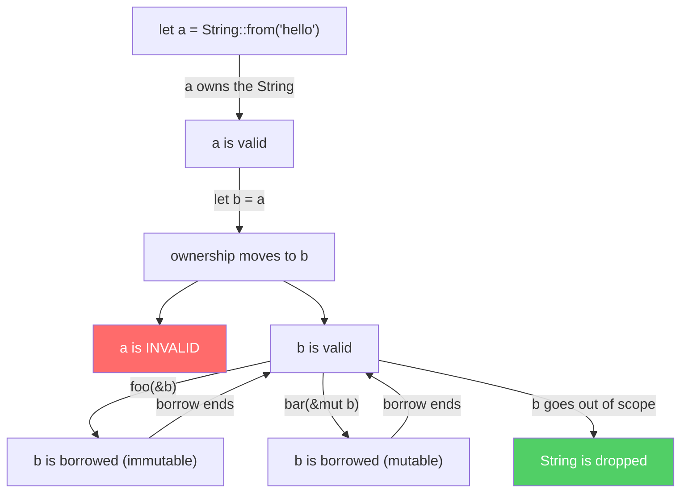
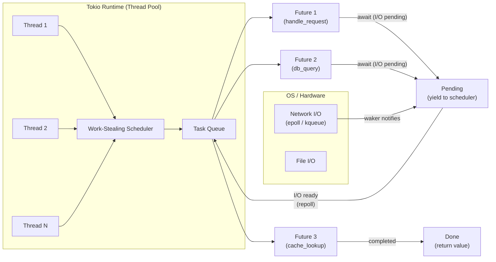
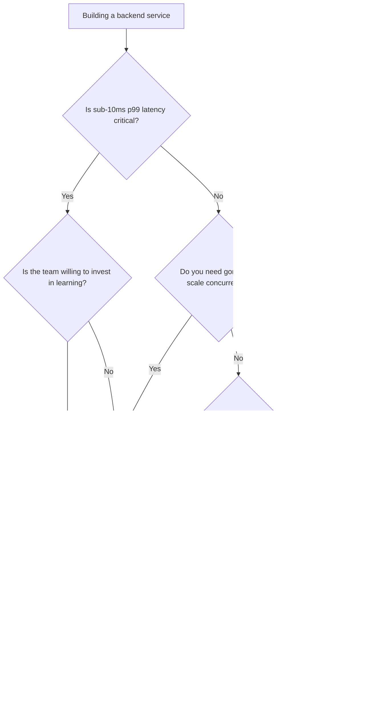

# Rust Backend Developer Fundamentals

> A practical guide to building production backend services in Rust, written for engineers coming from any language. This is the entry point for the Rust Backend Developer learning path.

---

## Table of Contents

1. [Why Rust for Backend in 2026](#1-why-rust-for-backend-in-2026)
2. [The Ownership Mental Model](#2-the-ownership-mental-model)
3. [Error Handling: No Exceptions, No Null](#3-error-handling-no-exceptions-no-null)
4. [Traits: Rust's Polymorphism](#4-traits-rusts-polymorphism)
5. [Async Rust and Tokio](#5-async-rust-and-tokio)
6. [Framework Landscape](#6-framework-landscape)
7. [Decision Framework: When Rust vs Others](#7-decision-framework-when-rust-vs-others)
8. [Common Pitfalls for Backend Developers](#8-common-pitfalls-for-backend-developers)
9. [What's Next](#9-whats-next)

---

## 1. Why Rust for Backend in 2026

`[Entry]` `[Mid]` `[Senior]`

Rust occupies a unique position in 2026: it gives you the performance and control of C and C++, the ergonomics of a modern language, and a compiler that catches entire categories of bugs before your code ever runs. No garbage collector pauses. No null pointer exceptions at runtime. No data races in concurrent code.

### The Value Proposition

**Memory safety without garbage collection.** Rust's ownership system enforces memory safety at compile time. The compiler proves your code is safe. No runtime overhead, no stop-the-world GC pauses, no unpredictable latency spikes. For backend services handling millions of requests, this means consistent p99 latency.

**Zero-cost abstractions.** You pay nothing for abstractions you use. Iterators, closures, async/await -- they compile down to the same machine code you would have written by hand. Your high-level code runs at low-level speed.

**Fearless concurrency.** The same ownership rules that guarantee memory safety also guarantee thread safety. If your code compiles, it is free of data races. This is not a convention or a lint rule -- it is a mathematical guarantee enforced by the compiler.

**Production-grade tooling.** Cargo handles builds, dependencies, testing, and publishing. Rustfmt formats code uniformly. Clippy catches common mistakes. The language server (rust-analyzer) provides IDE support that rivals any language. In 2026, the tooling is mature and stable.

### Who Ships Rust in Production

These are not experiments. These are production systems serving real traffic:

| Organization | Use Case | Why Rust |
|---|---|---|
| **Discord** | Read states service, replacing Go | Reduced p99 latency from outliers to consistent sub-ms |
| **Cloudflare** | Firewall rules, edge logic | Memory safety in network-facing code without GC pauses |
| **AWS** | Firecracker (microVM), Bottlerocket (OS) | Minimal footprint, fast startup, security |
| **Microsoft** | Windows kernel components, Azure services | Memory safety in systems code (70% of CVEs are memory issues) |
| **Shopify** | Build system, performance-critical services | Compile-time safety for developer tooling at scale |
| **Figma** | Server-side rendering, multiplayer engine | Performance and safety for real-time collaboration |
| **Dropbox** | File sync engine | Cross-platform native performance |

### Rust in 2026: State of the Art

The Rust 2024 edition brought significant improvements:

- **Async traits are stable.** No more `async-trait` crate workaround. You can write `async fn` in trait definitions directly.
- **Gen blocks and iterators.** Generator syntax for building custom iterators.
- **Improved error reporting.** The compiler now gives more targeted, actionable suggestions.
- **Stabilized APIs.** `impl Trait` in more positions, return-position `impl Trait` in trait methods.
- **Cargo improvements.** Better dependency resolution, faster compilation caching.

The ecosystem has matured. Axum dominates the web framework space. Tokio is the standard async runtime. SQLx provides compile-time checked SQL queries. The pieces fit together.

---

## 2. The Ownership Mental Model

`[Entry]` `[Mid]`

If you remember one thing from this guide, remember this: **ownership is Rust's central idea.** Everything else -- borrowing, lifetimes, traits, async -- builds on this foundation. If ownership clicks, the rest follows. If it does not, nothing else will make sense.

### The Rules

Every value in Rust has exactly one **owner** -- the variable that holds it. When the owner goes out of scope, the value is dropped (freed). There is no garbage collector because the compiler always knows exactly when to free memory.

```rust
fn main() {
    let name = String::from("Ferris"); // name owns the String
    println!("{name}");
    // name goes out of scope here, the String is dropped
}
```

**Assignment moves ownership, it does not copy.** This is the part that surprises people coming from other languages:

```rust
let a = String::from("hello");
let b = a;          // ownership moves from a to b
// println!("{a}"); // COMPILER ERROR: a no longer owns the value
println!("{b}");    // b is the owner now
```

This prevents double-free bugs. If both `a` and `b` pointed to the same heap memory and both tried to free it, you would have undefined behavior. Rust makes this impossible at compile time.

**Simple types copy instead of move.** Integers, floats, booleans, and other fixed-size types implement the `Copy` trait. Assignment duplicates the value:

```rust
let x: i32 = 42;
let y = x;      // i32 is Copy, so x is still valid
println!("{x}"); // this works fine
```

### Borrowing: Letting Someone Use Your Data

If you want to use a value without taking ownership, you **borrow** it. A borrow is a reference -- a pointer that the borrow checker validates at compile time.

**Rules of borrowing:**
- You can have any number of immutable borrows (`&T`), OR
- Exactly one mutable borrow (`&mut T`)
- But never both at the same time

```rust
fn calculate_length(s: &String) -> usize { // borrows immutably
    s.len()
} // borrow ends, but the String is NOT dropped (we don't own it)

fn append_world(s: &mut String) { // borrows mutably
    s.push_str(", world");
}

fn main() {
    let mut greeting = String::from("hello");
    let len = calculate_length(&greeting); // immutable borrow
    append_world(&mut greeting);           // mutable borrow
    println!("{greeting} has length {len}");
}
```

### Lifetimes: How Long Borrows Are Valid

Every reference has a **lifetime** -- the scope for which it is valid. Most of the time, the compiler infers lifetimes automatically. When it cannot, you tell it:

```rust
fn longest<'a>(x: &'a str, y: &'a str) -> &'a str {
    if x.len() > y.len() { x } else { y }
}
```

The `<'a>` annotation says: "the returned reference lives as long as the shorter of the two inputs." This prevents dangling pointers at compile time.

### Ownership Flow Diagram



### Why This Matters for Backend

In a backend service, you are passing requests through handlers, middleware, database clients, and response serializers. Ownership guarantees:

1. **No use-after-free.** A request handler cannot access a connection after it has been returned to the pool, because the borrow checker prevents it.
2. **No data races.** If one task has a mutable reference to a connection, no other task can access it simultaneously.
3. **Predictable resource cleanup.** When a database connection goes out of scope, it is returned to the pool. No finalizer, no `try/finally`, no forgotten cleanup.

---

## 3. Error Handling: No Exceptions, No Null

`[Entry]` `[Mid]`

Rust has no exceptions and no null. Instead, it uses two types to represent the possibility of failure:

- `Option<T>` -- a value that might be absent (`Some(value)` or `None`)
- `Result<T, E>` -- an operation that might fail (`Ok(value)` or `Err(error)`)

### Result and the Question Mark Operator

```rust
use std::fs;
use std::io;

fn read_config(path: &str) -> Result<String, io::Error> {
    let content = fs::read_to_string(path)?; // ? propagates errors
    Ok(content.trim().to_string())
}
```

The `?` operator is the backbone of Rust error handling. It means: "If this is `Ok`, unwrap the value. If this is `Err`, return the error from the current function immediately." No try/catch blocks, no hidden control flow.

### Why This Beats Exceptions

| Aspect | Exceptions (Java/Python) | Result (Rust) |
|---|---|---|
| **Visibility** | Any function can throw; not visible in signature | Return type makes failure explicit |
| **Handling** | Easy to forget a catch | Compiler warns on unused Result |
| **Control flow** | Invisible jumps | Linear, readable flow |
| **Performance** | Stack unwinding cost on throw | Zero cost on success path |
| **Types** | One exception hierarchy | Each error is its own type |

### Error Handling in a Backend Service

Here is how errors flow through a real backend handler:

```rust
use axum::{Json, http::StatusCode};
use serde::{Deserialize, Serialize};

#[derive(Deserialize)]
struct CreateUser {
    email: String,
    name: String,
}

#[derive(Serialize)]
struct UserResponse {
    id: u64,
    email: String,
    name: String,
}

#[derive(Debug)]
enum AppError {
    Database(sqlx::Error),
    Validation(String),
    NotFound,
}

// Convert AppError into HTTP responses
impl axum::response::IntoResponse for AppError {
    fn into_response(self) -> axum::response::Response {
        let (status, message) = match self {
            AppError::Database(e) => {
                tracing::error!("database error: {e}");
                (StatusCode::INTERNAL_SERVER_ERROR, "Internal error".to_string())
            }
            AppError::Validation(msg) => (StatusCode::BAD_REQUEST, msg),
            AppError::NotFound => (StatusCode::NOT_FOUND, "Not found".to_string()),
        };
        (status, Json(serde_json::json!({ "error": message }))).into_response()
    }
}

async fn create_user(
    State(pool): State<PgPool>,
    Json(input): Json<CreateUser>,
) -> Result<Json<UserResponse>, AppError> {
    if input.email.is_empty() {
        return Err(AppError::Validation("email is required".into()));
    }

    let row = sqlx::query_as!(
        UserRow,
        "INSERT INTO users (email, name) VALUES ($1, $2) RETURNING id, email, name",
        input.email, input.name
    )
    .fetch_one(&pool)
    .await
    .map_err(AppError::Database)?;

    Ok(Json(UserResponse {
        id: row.id,
        email: row.email,
        name: row.name,
    }))
}
```

Notice the pattern: every fallible operation returns a `Result`. The `?` operator propagates errors. The `IntoResponse` trait converts errors into HTTP responses at the framework boundary. No exceptions, no hidden control flow, no unhandled cases.

### Option: The End of NullPointerException

```rust
fn find_user(id: u64, pool: &PgPool) -> Option<User> {
    // Returns Some(user) or None -- never null
    users.get(&id)
}

match find_user(42, &pool) {
    Some(user) => println!("Found: {}", user.name),
    None => println!("User not found"),
}
```

The compiler forces you to handle both cases. You cannot forget.

---

## 4. Traits: Rust's Polymorphism

`[Entry]` `[Mid]` `[Senior]`

Traits are Rust's answer to interfaces, abstract classes, and typeclasses. A trait defines shared behavior. Types implement traits to opt into that behavior.

### Defining and Implementing Traits

```rust
trait Repository {
    type Entity;
    async fn find_by_id(&self, id: u64) -> Result<Option<Self::Entity>, DbError>;
    async fn save(&self, entity: &Self::Entity) -> Result<(), DbError>;
}

struct PostgresUserRepo {
    pool: PgPool,
}

impl Repository for PostgresUserRepo {
    type Entity = User;

    async fn find_by_id(&self, id: u64) -> Result<Option<User>, DbError> {
        sqlx::query_as!(User, "SELECT * FROM users WHERE id = $1", id)
            .fetch_optional(&self.pool)
            .await
            .map_err(DbError::from)
    }

    async fn save(&self, user: &User) -> Result<(), DbError> {
        sqlx::query!(
            "INSERT INTO users (id, name, email) VALUES ($1, $2, $3)",
            user.id, user.name, user.email
        )
        .execute(&self.pool)
        .await
        .map_err(DbError::from)?;
        Ok(())
    }
}
```

### Trait Bounds: Constraining Generic Types

```rust
fn process_entity<T>(entity: &T)
where
    T: Repository + Send + Sync,
{
    // T must implement Repository AND be thread-safe
}
```

Trait bounds are how Rust does generics with constraints. The compiler monomorphizes generic code -- it generates a specialized version for each concrete type. Zero runtime cost.

### Common Traits You Will Implement

| Trait | Purpose | Derived? |
|---|---|---|
| `Debug` | Formatting for debugging (`{:#?}`) | Yes, `#[derive(Debug)]` |
| `Clone` | Explicit duplication | Yes, `#[derive(Clone)]` |
| `Copy` | Implicit duplication (stack types only) | Yes, if all fields are `Copy` |
| `Serialize` / `Deserialize` | JSON (and other) serialization | Yes, via serde |
| `From` / `Into` | Type conversions | Manual, but trivial |
| `Display` | User-facing formatting | Manual |
| `Error` | Custom error types | Manual, or use `thiserror` |

### Async Traits (2026)

Since Rust 1.75 and the 2024 edition, async functions in traits are first-class:

```rust
trait EventHandler {
    async fn handle(&self, event: Event) -> Result<(), AppError>;
}

struct OrderProcessor {
    repo: PostgresOrderRepo,
    notifier: NotificationService,
}

impl EventHandler for OrderProcessor {
    async fn handle(&self, event: Event) -> Result<(), AppError> {
        let order = self.repo.find_by_id(event.order_id).await?;
        self.notifier.send_confirmation(&order).await?;
        Ok(())
    }
}
```

No more `#[async_trait]` macro. No more boxing. The compiler handles it natively.

### Traits vs. Interfaces

If you are coming from Java or C#, think of traits as more powerful interfaces:

- Traits can have default implementations (like Java 8 default methods)
- Traits can have associated types (like a generic interface)
- Traits support operator overloading
- Traits are used for zero-cost abstractions via monomorphization
- No inheritance hierarchy -- composition only

---

## 5. Async Rust and Tokio

`[Entry]` `[Mid]` `[Senior]`

Backend services are I/O-bound: waiting for databases, network calls, file reads. Async Rust lets you handle thousands of concurrent I/O operations without thousands of OS threads.

### The Model

An async function returns a `Future` -- a state machine that can be polled. The runtime (Tokio) drives these futures to completion, switching between them when they would otherwise block on I/O.

```rust
async fn fetch_user(pool: &PgPool, id: u64) -> Result<User, sqlx::Error> {
    // This does NOT block a thread while waiting for the database
    sqlx::query_as!(User, "SELECT * FROM users WHERE id = $1", id)
        .fetch_one(pool)
        .await // yield to runtime until the query completes
}
```

### The Tokio Runtime

Tokio is the de facto standard async runtime for Rust. It provides:

- **A work-stealing task scheduler** across a thread pool
- **Async I/O drivers** for TCP, UDP, Unix sockets, files
- **Timers and intervals**
- **Synchronization primitives** (channels, mutexes, semaphores)

```rust
#[tokio::main]
async fn main() {
    let listener = TcpListener::bind("0.0.0.0:3000").await.unwrap();
    println!("Server listening on port 3000");

    loop {
        let (stream, addr) = listener.accept().await.unwrap();
        // Spawn a new task for each connection
        tokio::spawn(async move {
            if let Err(e) = handle_connection(stream).await {
                tracing::error!("error handling {addr}: {e}");
            }
        });
    }
}
```

### Async Runtime Model



### Spawning Tasks

`tokio::spawn` creates a new concurrent task. It is the async equivalent of starting a thread, but far cheaper:

```rust
tokio::spawn(async move {
    // This runs concurrently with other tasks
    let result = expensive_computation().await;
    tracing::info!("result: {result}");
});
```

**Critical rule:** Never block the async runtime. If you have CPU-heavy work, use `tokio::task::spawn_blocking`:

```rust
// CPU-heavy work -- use spawn_blocking to avoid blocking the runtime
let hash = tokio::task::spawn_blocking(move || {
    argon2::hash_password(password, &salt)
}).await.map_err(|e| AppError::Internal(e.to_string()))?;
```

### When Sync vs Async

| Scenario | Use | Reason |
|---|---|---|
| HTTP handler with DB queries | Async | Waiting on I/O |
| File uploads / downloads | Async | Network I/O |
| CPU-heavy computation (hashing, parsing) | Sync (spawn_blocking) | Avoids blocking the runtime |
| Short-lived CLI tool | Sync | Simpler, no runtime overhead |
| Background job processor | Async with spawn_blocking | Mix of I/O and CPU work |

---

## 6. Framework Landscape

`[Entry]` `[Mid]`

The Rust web framework ecosystem has consolidated. Here is the state of affairs in 2026.

### Axum

Built by the Tokio team. Uses hyper for HTTP and Tower for middleware. Dominant in 2026.

```rust
use axum::{Router, routing::{get, post}, Json};
use sqlx::PgPool;

let app = Router::new()
    .route("/health", get(health_check))
    .route("/users", post(create_user))
    .route("/users/{id}", get(get_user))
    .layer(TraceLayer::new_for_http())
    .with_state(pool);
```

**Strengths:** Ecosystem alignment (same team as Tokio, hyper, Tower). Excellent composability via Tower middleware. Minimal magic -- you see exactly what is happening. First-class async support.

### Actix-web

Mature, performant, predates Axum. Uses the Actor model internally.

```rust
use actix_web::{web, App, HttpServer};

HttpServer::new(|| {
    App::new()
        .route("/health", web::get().to(health_check))
        .route("/users", web::post().to(create_user))
})
.bind("0.0.0.0:3000")?
.run()
.await?;
```

**Strengths:** Extremely fast in benchmarks. Large middleware library. Stable API. Good documentation.

**Weaknesses:** Different mental model (actor-based). Less alignment with the Tokio ecosystem. Slightly more boilerplate.

### Salvo

A rising framework focused on simplicity and developer experience. Built on hyper and Tokio.

```rust
use salvo::prelude::*;

let router = Router::new()
    .push(Router::with_path("health").get(health_check))
    .push(Router::with_path("users").post(create_user));
```

**Strengths:** Simple API. Good for rapid prototyping. Integrated features (WebSocket, CORS, etc.).

**Weaknesses:** Smaller ecosystem. Fewer production deployments. Less community knowledge to draw on.

### Comparison Table

| Feature | Axum | Actix-web | Salvo |
|---|---|---|---|
| **Performance** | Excellent | Excellent | Good |
| **Ecosystem** | Largest (Tokio/hyper/Tower) | Large (own ecosystem) | Growing |
| **Learning curve** | Moderate | Moderate | Low |
| **Middleware model** | Tower layers | Guards/extractors | Built-in handlers |
| **Async runtime** | Tokio | Tokio (previously own runtime) | Tokio |
| **Production readiness** | Proven at scale | Proven at scale | Emerging |
| **Community** | Very active | Active | Growing |
| **Best for** | New projects, microservices | High-throughput services | Rapid prototypes |

**Recommendation for 2026:** Use Axum unless you have a specific reason not to. The ecosystem alignment with Tokio, hyper, and Tower means fewer compatibility issues and better community support.


---

## 7. Decision Framework: When Rust vs Others

`[Mid]` `[Senior]`

Rust is not always the right answer. Here is when it is and when it is not.

### Rust vs Go

| Aspect | Rust | Go |
|---|---|---|
| **Memory management** | Compile-time ownership | Garbage collected |
| **Concurrency model** | Fearless (ownership enforces safety) | Goroutines (simple, effective) |
| **Error handling** | Result type (explicit) | Error values (convention) |
| **Learning curve** | Steep (ownership, lifetimes) | Gentle (simple language) |
| **Build speed** | Slow (especially first build) | Fast |
| **Ecosystem maturity** | Good, growing | Excellent |
| **P99 latency** | Predictable, no GC pauses | Occasional GC spikes |
| **Best for** | Latency-critical, safety-critical | High-throughput services, dev speed |

**Choose Rust when:** Latency matters. Memory safety matters. You need predictable performance.

**Choose Go when:** Developer velocity matters. Your team is new to systems programming. You need goroutine-level concurrency simplicity.

### Rust vs C++

| Aspect | Rust | C++ |
|---|---|---|
| **Memory safety** | Guaranteed by compiler | Manual, error-prone |
| **Modern tooling** | Cargo, rustfmt, clippy | CMake, varying quality |
| **Package management** | Cargo (integrated) | vcpkg, conan (fragmented) |
| **Legacy code** | Greenfield | Massive existing codebases |
| **Learning curve** | Steep but guided | Steep and unguided |
| **Best for** | New systems projects | Existing C++ codebases, gamedev |

**Choose Rust when:** Starting new systems-level work. Security is a priority.

**Choose C++ when:** Working in an existing C++ codebase. You need specific C++ libraries.

### Rust vs Java / Python

| Aspect | Rust | Java / Python |
|---|---|---|
| **Runtime performance** | Native (C/C++ speed) | JVM / interpreted |
| **Memory usage** | Minimal | Significant (JVM overhead / GC) |
| **Startup time** | Instant | JVM: slow; Python: moderate |
| **Development speed** | Slower (compiler checks) | Faster (dynamic) |
| **Best for** | Performance-critical services | Rapid iteration, business logic |

**Choose Rust when:** Performance is a competitive advantage. Resource usage matters. You are building infrastructure.

**Choose Java/Python when:** Time to market is the priority. Business logic is complex but performance is adequate. Your team has deep Java/Python expertise.

### Decision Matrix



---

## 8. Common Pitfalls for Backend Developers

`[Entry]` `[Mid]`

Every Rust beginner hits the same walls. Here is how to get over them faster.

### Pitfall 1: Fighting the Borrow Checker

**The problem:** You try to hold a mutable reference while iterating, or modify a collection while reading from it. The compiler rejects your code. You fight it. You add `.clone()` everywhere.

**The fix:** The borrow checker is telling you something real. If it rejects your code, you likely have a real ownership ambiguity. Instead of fighting:

1. **Restructure your data.** If two things need mutable access to the same data, they might belong in different scopes.
2. **Use indices instead of references.** Replace `&items[i]` with just the index `i`.
3. **Split borrows.** Rust allows borrowing different fields of a struct simultaneously.
4. **Reach for `std::cell::RefCell` or `std::sync::Arc<Mutex<T>>` only as a last resort.**

```rust
// BAD: fighting the checker with unnecessary clones
fn process(items: &mut Vec<String>) {
    let copy = items.clone(); // expensive!
    for item in copy.iter() {
        items.push(format!("{item}_processed"));
    }
}

// GOOD: restructure to avoid the conflict
fn process(items: &mut Vec<String>) {
    let new_items: Vec<String> = items.iter()
        .map(|item| format!("{item}_processed"))
        .collect();
    items.extend(new_items);
}
```

### Pitfall 2: Using unwrap() in Production

**The problem:** `unwrap()` panics. In a backend service, a panic kills the current task or the entire process. One bad input, one missing database row, and your service is down.

**The fix:** Handle the error. Always.

```rust
// BAD: panics on None or Err
let user = users.get(&id).unwrap();
let conn = pool.acquire().await.unwrap();

// GOOD: propagate or handle
let user = users.get(&id).ok_or(AppError::NotFound)?;
let conn = pool.acquire().await.map_err(AppError::Database)?;
```

Enable `#![deny(clippy::unwrap_used)]` in your production crates to catch these at compile time.

### Pitfall 3: Blocking the Async Runtime

**The problem:** Calling a blocking operation (file I/O, CPU-heavy computation, synchronous library) inside an async function. This blocks one of the runtime's worker threads, reducing concurrency for all tasks.

**The fix:** Use `spawn_blocking` for CPU-heavy work. Use async versions of I/O operations.

```rust
// BAD: blocks the runtime
async fn hash_password(password: String) -> String {
    argon2::hash_password(&password, &salt) // synchronous, CPU-heavy
}

// GOOD: offload to blocking thread pool
async fn hash_password(password: String) -> Result<String, AppError> {
    tokio::task::spawn_blocking(move || {
        argon2::hash_password(&password, &salt)
    })
    .await
    .map_err(|e| AppError::Internal(e.to_string()))?
}
```

### Pitfall 4: Holding Locks Across Await Points

**The problem:** Holding a `Mutex` lock across an `.await` point. If the future is suspended while holding the lock, other tasks cannot proceed. Worse, this can deadlock.

**The fix:** Drop the lock before awaiting. Use `tokio::sync::Mutex` sparingly -- prefer `std::sync::Mutex` for short, synchronous critical sections.

```rust
// BAD: lock held across await
let mut cache = cache.lock().await;
let value = fetch_from_db(&pool).await; // lock still held!
cache.insert(key, value);

// GOOD: scope the lock, then await
{
    let cache = cache.lock().await;
    if let Some(value) = cache.get(&key) {
        return Ok(value.clone());
    }
} // lock dropped here
let value = fetch_from_db(&pool).await;
cache.lock().await.insert(key, value.clone());
```

### Pitfall 5: Ignoring Connection Pool Sizing

**The problem:** Opening too many database connections or reusing connections across tasks without proper pooling.

**The fix:** Use `sqlx`'s built-in pool with explicit sizing:

```rust
let pool = PgPoolOptions::new()
    .max_connections(20)          // match your DB connection limit
    .min_connections(5)
    .acquire_timeout(Duration::from_secs(5))
    .idle_timeout(Duration::from_secs(600))
    .connect(&database_url)
    .await?;
```

### Pitfall 6: String Abuse

**The problem:** Using `String` everywhere, causing unnecessary allocations.

**The fix:** Use `&str` for borrowed string data. Use `String` only when you need ownership. Use `Cow<str>` when you sometimes need ownership and sometimes do not.

```rust
fn greet(name: &str) -> String {  // borrows input, owns output
    format!("Hello, {name}!")
}
```

---

## 9. What's Next

`[Entry]` `[Mid]` `[Senior]`

This guide covers the fundamentals. The learning path continues with hands-on projects:

1. **Project 01 -- HTTP API with Axum:** Build a REST API from scratch. Routing, handlers, middleware, JSON serialization. You will apply ownership, error handling, and async in a real service.

2. **Project 02 -- Database Integration:** Connect to PostgreSQL with SQLx. Write compile-time checked queries. Handle migrations. Build a repository layer with traits.

3. **Project 03 -- Authentication and Authorization:** Implement JWT-based auth. Middleware for token validation. Role-based access control using Rust's type system.

4. **Project 04 -- Background Workers and Queues:** Process jobs asynchronously. Integrate with Redis queues. Handle retries and dead-letter queues.

5. **Project 05 -- Observability:** Structured logging with `tracing`. Metrics with Prometheus. Distributed tracing. You will understand what your service is doing in production.

6. **Project 06 -- Production Deployment:** Containerize with Docker. Optimize binary size. Configure health checks and graceful shutdown.

7. **Capstone -- Full Microservice:** Combine everything into a production-grade microservice with database, auth, background workers, observability, and CI/CD.

Each project builds on the previous one. By the end, you will have the skills and confidence to build and ship Rust backend services in production.


---

## References

- [The Rust Programming Language](https://doc.rust-lang.org/book/) -- the official book
- [Rust by Example](https://doc.rust-lang.org/rust-by-example/) -- learn by doing
- [Tokio Documentation](https://tokio.rs/) -- async runtime reference
- [Axum Documentation](https://docs.rs/axum) -- web framework reference
- [SQLx Documentation](https://docs.rs/sqlx) -- database toolkit
- [Rust 2024 Edition Guide](https://doc.rust-lang.org/edition-guide/rust-2024/) -- what changed
